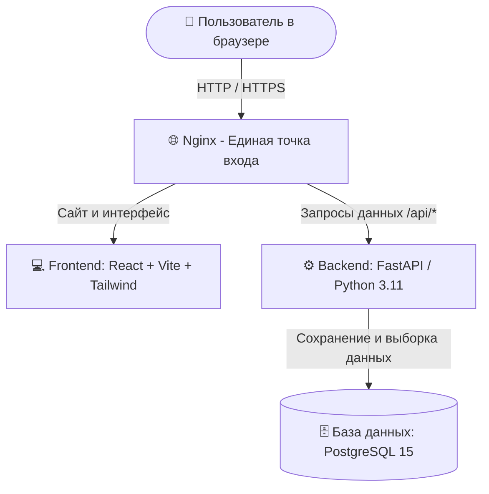

# 🎓 AMG LMS — Корпоративная платформа тестирования и аттестации

> **Современная система для проверки знаний сотрудников и кандидатов.**  
> Создавайте тесты, используйте библиотеку вопросов, назначайте аттестации с дедлайнами, проверяйте открытые ответы и получайте наглядную аналитику — всё в едином интерфейсе с защитой от списывания.

---

## 💡 Что это такое простыми словами?

Представьте удобный сервис вроде Google Форм или обучающих платформ, но созданный специально для внутренних задач компании:

* **Для руководителя и HR:** больше никаких бумажных опросников и ручных подсчетов баллов. Вы составляете тест за несколько минут, отправляете ссылку сотрудникам или кандидатам и сразу видите наглядный отчет — кто сдал, кто провалил и где возникли сложности.
* **Для сотрудников:** понятный личный кабинет. Видно, какие тесты назначены, до какого числа их нужно сдать, сколько времени дается на попытку и какие комментарии оставил проверяющий.
* **Для кандидатов на работу (гостей):** не нужно регистрироваться в системе — достаточно перейти по персональной ссылке, ввести свои имя/фамилию и пройти вводный экзамен.

---

## ✨ Ключевые возможности

* 📝 **Гибкий конструктор тестов:**
  * **Один правильный ответ** (выбор из списка).
  * **Несколько правильных ответов** (чекбоксы).
  * **Текстовый ввод** (робот сверяет точное ключевое слово или аббревиатуру).
  * **Развернутый ответ / Эссе** (проверяется администратором вручную с выставлением баллов).
* 📚 **Библиотека (банк) вопросов:**  
  Сохраняйте удачные вопросы по отделам (IT, Продажи, Бухгалтерия, Безопасность) и повторно добавляйте их в любые новые тесты за один клик.
* ⏱ **Честный таймер и защита от списывания:**
  * Правильные ответы **не передаются в браузер**, поэтому их невозможно подсмотреть через код страницы (F12 / DevTools).
  * Время прохождения контролируется на сервере. Нельзя «заморозить» таймер или накрутить результат.
* ✍️ **Гибридная проверка:**  
  Тестовые вопросы проверяются мгновенно роботом. Вопросы с развернутым ответом отправляются в очередь на ручную проверку, где методист может оставить персональную рецензию и пояснение к оценке.
* 🔗 **Гостевой доступ без регистрации:**  
  Генерация уникальных ссылок для соискателей на вакансии или внешних стажеров.
* 📊 **Глубокая аналитика:**  
  Узнайте средний балл, процент успешных сдач, рейтинг сложных вопросов и подробную историю каждого сотрудника.

---

## 👥 Роли в системе: кто и что может делать?

| Роль | Для кого предназначена | Что может делать? |
| :--- | :--- | :--- |
| 👑 **Суперадминистратор** | Руководитель IT, директор компании | Полный доступ: добавление и блокировка пользователей, смена ролей, создание любых тестов, просмотр всех отчетов и системных настроек. |
| 🎓 **Администратор / Экзаменатор** | HR-менеджер, тимлид, методист | Создание тестов и черновиков, наполнение банка вопросов, назначение тестирования сотрудникам с указанием крайнего срока (дедлайна), ручная проверка открытых вопросов, просмотр аналитики. |
| 💼 **Сотрудник** | Штатный специалист компании | Просмотр каталога доступных тестов, прохождение назначенных заданий на время, просмотр своих результатов, истории попыток и замечаний проверяющего. |
| 👤 **Гость / Соискатель** | Кандидат на собеседовании | Прохождение теста по уникальной прямой ссылке без регистрации и пароля. Результат сразу попадает в отчет компании. |

---

## 🚀 Быстрый старт на вашем компьютере (за 3 минуты)

Для запуска нужен только установленный **[Docker Desktop](https://www.docker.com/products/docker-desktop/)** (он уже включает Docker и Docker Compose).

### Шаг 1. Скачайте проект и перейдите в папку
```bash
git clone <URL_ВАШЕГО_РЕПОЗИТОРИЯ> lms
cd lms
```

### Шаг 2. Создайте файл конфигурации
Просто скопируйте готовый шаблон настроек:
* **В Linux / macOS:**
  ```bash
  cp .env.example .env
  ```
* **В Windows (PowerShell):**
  ```powershell
  copy .env.example .env
  ```

### Шаг 3. Запустите проект
Выполните одну команду:
```bash
docker compose up --build -d
```
> ⏳ *При первом запуске Docker сам скачает нужные компоненты, создаст базу данных, применит таблицы и добавит демонстрационные тесты и учетные записи. Это займет около 1–2 минут.*

### Шаг 4. Откройте в браузере
* **Адрес сайта:** [http://localhost](http://localhost)
* **Интерактивная документация к API (для разработчиков):** [http://localhost/docs](http://localhost/docs)

---

## 🔑 Готовые учетные записи для входа

После запуска в системе уже созданы учетные записи для тестирования:

| Роль | Электронная почта (логин) | Пароль | Что можно протестировать |
| :--- | :--- | :--- | :--- |
| **Администратор** | `admin@company.com` | `admin123` | Создание тестов, банк вопросов, проверка работ, назначение сотрудникам |
| **Сотрудник** | `employee@company.com` | `employee123` | Прохождение тестов с таймером, просмотр личных оценок |

> 💡 *Также в базе уже подготовлен демонстрационный тест по **Информационной безопасности** и банк вопросов для разных отделов компании.*

---

## 🏗 Как устроен проект (Архитектура)

Система работает как слаженный оркестр из 4 изолированных контейнеров:



### Стек технологий:
1. **Frontend (внешний вид и интерфейс):** React 18, Vite, Tailwind CSS, иконки Lucide. Быстрый и современный интерфейс без перезагрузок страниц (SPA).
2. **Backend (сердце и логика):** Python 3.11, FastAPI (высокопроизводительный асинхронный фреймворк), SQLAlchemy 2.0, Pydantic v2, JWT-токены для безопасного входа.
3. **База данных:** PostgreSQL 15 (все данные хранятся надежно в изолированном томе `postgres_data`).
4. **Веб-сервер и маршрутизация:** Nginx (проксирует трафик, раздает статику, сжимает трафик через Gzip и отвечает за SSL-шифрование).

---

## 🛡 Защита от списывания (Anti-Cheat)

1. **Серверный подсчет баллов:**  
   Когда сотрудник нажимает «Начать тест», сервер отправляет в браузер формулировки вопросов и варианты ответов, но **никогда не отправляет метку правильности**. Подсмотреть правильный ответ в коде страницы или в сетевых запросах невозможно.
2. **Непреклонный таймер:**  
   Время старта и отправки фиксируется на сервере. Даже если пользователь отключит таймер на клиенте или изменит время на компьютере, сервер отклонит просроченную попытку.
3. **Журнал аудита:**  
   Система хранит точное время сдачи с точностью до секунды, количество набранных баллов и историю каждого ответа.

---

## 🌐 Развертывание на боевом сервере (VPS на Ubuntu)

Пошаговая инструкция для переноса системы на чистый виртуальный сервер (Ubuntu 22.04 или 24.04 LTS).

### Шаг 1. Подключение к серверу и настройка безопасности
Подключитесь по SSH и обновите систему:
```bash
ssh root@IP_ВАШЕГО_СЕРВЕРА

# Обновление пакетов
apt update && apt upgrade -y

# Настройка фаервола (открываем порты SSH, 80 и 443)
ufw allow OpenSSH
ufw allow 80/tcp
ufw allow 443/tcp
ufw --force enable
```

### Шаг 2. Установка Docker и Docker Compose
```bash
# Установка вспомогательных утилит
apt install -y ca-certificates curl gnupg lsb-release

# Добавление ключа Docker
mkdir -p /etc/apt/keyrings
curl -fsSL https://download.docker.com/linux/ubuntu/gpg | gpg --dearmor -o /etc/apt/keyrings/docker.gpg

# Добавление официального репозитория
echo \
  "deb [arch=$(dpkg --print-architecture) signed-by=/etc/apt/keyrings/docker.gpg] https://download.docker.com/linux/ubuntu \
  $(lsb_release -cs) stable" | tee /etc/apt/sources.list.d/docker.list > /dev/null

# Установка Docker
apt update
apt install -y docker-ce docker-ce-cli containerd.io docker-buildx-plugin docker-compose-plugin
```

### Шаг 3. Загрузка проекта на сервер
```bash
cd /opt
git clone <URL_ВАШЕГО_РЕПОЗИТОРИЯ> lms
cd lms
```

### Шаг 4. Настройка боевого `.env`
```bash
cp .env.example .env
nano .env
```
Сгенерируйте секретный ключ командой:
```bash
openssl rand -hex 32
```
В файле `.env` задайте надежные значения:
* `POSTGRES_PASSWORD`: ваш надежный пароль для базы данных.
* `DATABASE_URL`: подставьте тот же пароль в строку подключения.
* `SECRET_KEY`: вставьте сгенерированный выше 64-значный ключ.
* `FIRST_SUPERADMIN_PASSWORD`: надежный пароль для главного администратора.
* `CORS_ORIGINS`: укажите домен вашего сайта (например: `["https://tests.mycompany.com"]`).

### Шаг 5. Запуск системы
```bash
docker compose up --build -d
```
Проверить статус работы всех контейнеров:
```bash
docker compose ps
```
Теперь сайт доступен по IP-адресу сервера: `http://IP_ВАШЕГО_СЕРВЕРА`!

---

## 🔒 Подключение бесплатного SSL-сертификата (HTTPS)

Чтобы сайт открывался по безопасному протоколу `https://tests.mycompany.com`:

### 1. Направьте домен на ваш сервер
В панели управления вашим доменом создайте **A-запись**, указывающую на IP-адрес вашего сервера.

### 2. Получите сертификат через Certbot
```bash
apt install -y certbot

# Временно останавливаем Nginx, чтобы освободить порт 80
docker compose stop nginx

# Выпускаем сертификат (замените домен и email на свои)
certbot certonly --standalone -d tests.mycompany.com --non-interactive --agree-tos --email admin@mycompany.com
```

### 3. Включите HTTPS в `nginx/default.conf`
Откройте файл `nginx/default.conf` и настройте перенаправление с HTTP на HTTPS:
```nginx
upstream backend_upstream {
    server backend:8000;
}

upstream frontend_upstream {
    server frontend:80;
}

# Редирект всех запросов с обычного HTTP на безопасный HTTPS
server {
    listen 80;
    server_name tests.mycompany.com;
    return 301 https://$host$request_uri;
}

# Защищенный HTTPS-сервер
server {
    listen 443 ssl http2;
    server_name tests.mycompany.com;

    ssl_certificate /etc/letsencrypt/live/tests.mycompany.com/fullchain.pem;
    ssl_certificate_key /etc/letsencrypt/live/tests.mycompany.com/privkey.pem;

    ssl_protocols TLSv1.2 TLSv1.3;
    ssl_ciphers HIGH:!aNULL:!MD5;
    ssl_prefer_server_ciphers on;

    client_max_body_size 25M;

    gzip on;
    gzip_comp_level 6;
    gzip_types text/plain text/css application/json application/javascript image/svg+xml;

    location /api/ {
        proxy_pass http://backend_upstream;
        proxy_http_version 1.1;
        proxy_set_header Host $host;
        proxy_set_header X-Real-IP $remote_addr;
        proxy_set_header X-Forwarded-For $proxy_add_x_forwarded_for;
        proxy_set_header X-Forwarded-Proto https;
    }

    location ~ ^/(docs|redoc|openapi.json) {
        proxy_pass http://backend_upstream;
        proxy_set_header Host $host;
        proxy_set_header X-Real-IP $remote_addr;
        proxy_set_header X-Forwarded-For $proxy_add_x_forwarded_for;
        proxy_set_header X-Forwarded-Proto https;
    }

    location / {
        proxy_pass http://frontend_upstream;
        proxy_set_header Host $host;
        proxy_set_header X-Real-IP $remote_addr;
        proxy_set_header X-Forwarded-For $proxy_add_x_forwarded_for;
        proxy_set_header X-Forwarded-Proto https;
    }
}
```

Запустите Nginx обратно:
```bash
docker compose up -d nginx
```

### 4. Автоматическое продление сертификата
Сертификаты Let's Encrypt действуют 90 дней. Добавьте задачу в планировщик `cron`, чтобы сервер сам обновлял их раз в месяц:
```bash
(crontab -l 2>/dev/null; echo "0 3 1 * * certbot renew --quiet --pre-hook 'docker compose -f /opt/lms/docker-compose.yml stop nginx' --post-hook 'docker compose -f /opt/lms/docker-compose.yml start nginx'") | crontab -
```

---

## 💾 Резервное копирование (Бэкап) и восстановление

Все ваши тесты, вопросы, пользователи и результаты хранятся в базе данных. Регулярно делайте копии!

### Создание резервной копии
Команда создает сжатый архив базы с текущей датой и временем:
```bash
docker compose exec -T db pg_dump -U postgres lms_db | gzip > "backup_$(date +%Y%m%d_%H%M%S).sql.gz"
```

### Восстановление из резервной копии
Если нужно вернуть данные из созданного файла (например, `backup_20260913_120000.sql.gz`):
```bash
gunzip < backup_20260913_120000.sql.gz | docker compose exec -T db psql -U postgres -d lms_db
```

---

## 🛠 Полезные команды на каждый день

* **Посмотреть логи сервера в реальном времени:**
  ```bash
  docker compose logs -f backend
  ```
* **Перезапустить всю систему:**
  ```bash
  docker compose restart
  ```
* **Остановить систему (данные в базе сохранятся):**
  ```bash
  docker compose down
  ```
* **Обновить код и пересобрать контейнеры:**
  ```bash
  git pull
  docker compose up --build -d
  ```

---

## 📂 Структура проекта

```
.
├── backend/                  # Серверная часть (FastAPI на Python)
│   ├── app/
│   │   ├── api/              # Маршруты: авторизация, тесты, попытки, банк вопросов
│   │   ├── core/             # Конфигурация, шифрование паролей, подключение к БД
│   │   ├── models/           # Схемы таблиц базы данных (SQLAlchemy)
│   │   └── main.py           # Точка старта API
│   ├── seed.py               # Автоматическое наполнение стартовыми данными
│   └── Dockerfile            # Инструкция сборки бэкенда
│
├── frontend/                 # Пользовательский интерфейс (React + Tailwind)
│   ├── src/
│   │   ├── components/       # Общие элементы (меню, шапка, защита роутов)
│   │   ├── context/          # Хранение сессии и данных текущего пользователя
│   │   └── pages/
│   │       ├── admin/        # Панель админа: конструктор, банк вопросов, аналитика
│   │       ├── employee/     # Кабинет сотрудника: каталог, тестирование, результаты
│   │       └── public/       # Страница сдачи для гостей по ссылке
│   └── Dockerfile            # Сборка веб-приложения
│
├── nginx/                    # Настройки главного веб-сервера (прокси)
├── docker-compose.yml        # Файл запуска всех компонентов системы
├── .env.example              # Образец файла настроек
└── README.md                 # Документация (этот файл)
```

---

## 💬 Поддержка и обратная связь

Если у вас возникли вопросы по настройке, предложения по улучшению функционала или вы обнаружили ошибку — создайте **Issue** в репозитории проекта или свяжитесь с ответственным администратором.
